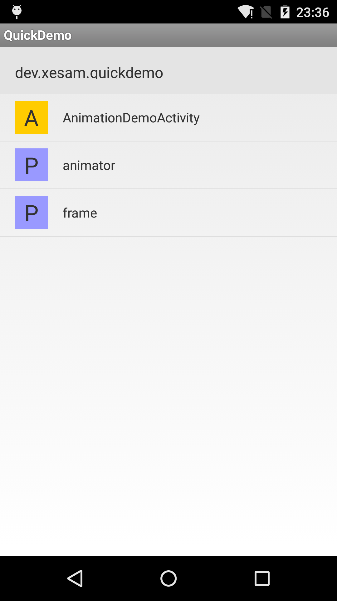
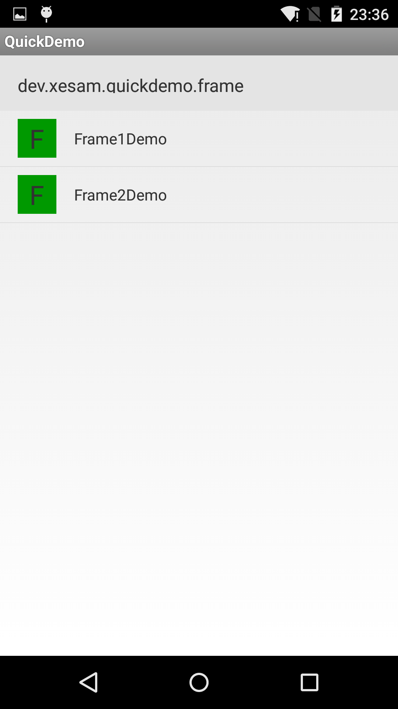
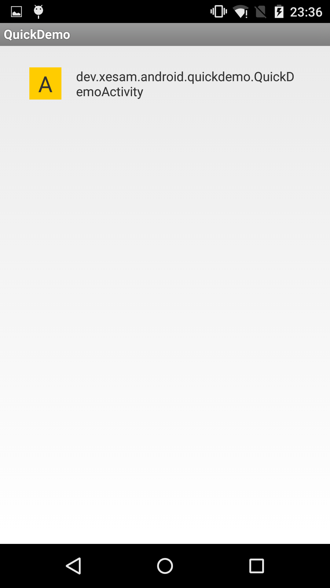

#AndroidQuickDemo

# 设计目的

在我们写一些 demo 的时候，经常需要针对每种情况写一个用户示例，新建 Activity 的过程太麻烦，所以这个库的作用就是自动帮你创建索引式的导航列表，一行代码搞定所有的示例。

# 使用方式

    compile 'dev.xesam.android:quick-demo-creator:0.1.0'
    
# 两种模式：

## 1. 列出所有已经注册的Activity，点击即可打开

用法：

    QuickDemo.inflateActivity(activity, R.id.listview);

## 2. 像文件管理器一样，列出 app 中 package 的目录索引，并按照给定的过滤规则过滤需要展示的组件（Activity 以及 Fragment）

用法：

    将 dev.xesam.android.quickdemo.QuickDemoActivity 设置为 LAUNCHER Activity 即可

# 默认过滤规则

如果觉得不想使用demo，sample之类的名称，可以自定义多虑规则 参见 SimpleFilter：

    public class SimpleFilter implements QuickDemoFilter {

        Pattern target = Pattern.compile("demo|sample|example", Pattern.CASE_INSENSITIVE);
        String pkgName;

        public SimpleFilter(Context context) {
            pkgName = context.getPackageName();
        }

        @Override
        public boolean filter(String className) {
            String[] comps = className.split("\\.");
            String simpleClassName = comps[comps.length - 1];
            return className.startsWith(pkgName) && target.matcher(simpleClassName).find();
        }
    }

## 原理说明

1. 遍历指定包名下的所有 Fragment 与 Activity
2. 过滤出符合条件的所有 Fragment 与 Activity，得到相应的界面结合
3. 构建集合的树形结构
4. 在预定的宿主 Activity 里面显示所有的 Fragment 与 Activity

# 效果

